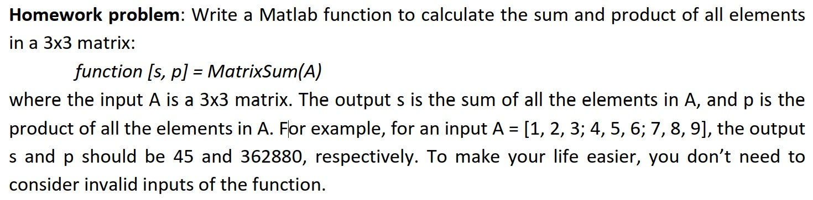

## VG101 FA2021 RC 1

### general tips for VG101

1. Self study, and study ahead of schedule, but you needn't be involute(juan) in VG101.
2. Be good at using search engine and matlab `help` function
3. Write more codes, and <del>finish labs and homework once they're released</del> start early when it comes to labs and homework.
4. Attend lectures and RC.(RC is mandatory, and we may say some grade-related things)
5. Ask when needed, but in a wisdom way. (https://github.com/ryanhanwu/How-To-Ask-Questions-The-Smart-Way/blob/main/README-zh_CN.md)


### computer basic

algorithm: a procedure for solving problems.

Features: input, output, finity, certainty, feasibility.


the programming language: machine code, assembly code and high-level language.

High-level language: C, C++, Java, python, C#, JavaScript, matlab, Elm, bash ...


The classification of high-level language: compilation and interpretation.

compilation: C, C++, Java, C#, (Elm)

C, C++ $$\rightarrow$$ assembly

Java, C# $$\rightarrow$$ Bytecode (Bytecode interpreted)

Elm $$\rightarrow$$ JavaScript

interpretation: python, JavaScript, bash, **matlab**


### Base Conversion

1. concept about base
   
2. Binary to Decimal:
   $$
   \left(a_n...a_1a_0\right)_2=\sum_{i=0}^na_i2^i
   $$

3. Binary to Hexadecimal/ Hexadecimal to binary
   $$
   (a_1a_2a_3a_4|a_5a_6a_7a_8)_2=0xh_1h_2
   $$
   Memorize the binary form from 0 to f, it will be useful.

4. Decimal to binary: divide 2, record remainder, and reverse them.

   example: turn 78 into binary

$$
78=39*2+0\\
39=19*2+1\\
19=9*2+1\\
9=4*2+1\\
4=2*2+0\\
2=1*2+0\\
1=0*2+1\\
(78)_{10}=(1001110)_2
$$

4. Arbitrary base conversion: First turn to decimal, then turn to the target base again.

### matlab

#### WHAT is MATLAB

- Interpreting  language, don't require type specification
- Powerful in mathematical calculation and simulation
- Matrix powered
- Interactive, can be used like a calculator

#### Variables and Declaration

- Use assignment to create new variables

  a = 1; % Create variable a with value 1

  arr = [1 2 3]; % Create an array. Or: arr=[1,2,3]

  mat = [1 2 3; 4 5 6; 7 8 9]; % Create a matrix

- Types are automatically determined, at most time it's double(short)

- Single variables are simply 1*1 matrix

- Arrays are nx1 matrix

- create array: using `:` initial: step: final; when step=1 you can write initial: final

#### Variables and Type

1. Numeric Type

   - Integer

     Unsigned integers are denoted "uintx" and "x" is the number of bit it takes in memory.

     Singed integers are denoted "intx" which follows 2's compliment convention.

     **Calculate Maximum&Minimum**
     $$
     uintx: 2^x-1\\
     intx: -2^{x-1}, 2^{x-1}-1
     $$
     WHY?

   - Floating-point Number

     Use some of the bits to denote exponential numbers, so that it could store fractions. However, it will lose accuracy when numbers are too big/small (floating point error).
     
     ```matlab
     >> 0.314+0.3244==0.6384
     
     ans =
     
       logical
     
        0
     ```
     
     

2. Character

   Character is actually int8. It's numeric value is the ASCII code of the character. Strings are character arrays.

3. Composite Data Types

#### Arithmetic Expressions

1. If you have ";" as the end of an expression, it will prevent output. This is good habit!
2. Arithmetic operations in MATLAB includes "+", "-", "*", "/", "**^**" and their point-wise version.

#### Basic Commands

1. Use clear/clear all to clear up the working region. Don't use clear in functions!
2. Use clear + variable name to clear up certain variable.

#### matlab files(*.m)

Two types of matlab files: script and function.

##### script

An ordered set of commands. Matlab interpret them line by line.

```matlab
a=3;
b=5
c=a+b
fprintf('c=%d',c);
```

result:

```matlab
b =

     5


c =

     8

c=8
```

It's the same as putting them line by line into the command line. It can influence, or be influenced by the current workspace.

##### function

```matlab
function [output_parameter_list] = function_name(input_parameter_list) % prototype
```
Output parameter is also known as "return value".
```matlab
function [max, maxPlace] = find_max(A)
%find the maximum element and its index in a row vector
max=0;
maxPlace=0;
sz=size(A,2);
for ii=1:sz
if A(ii)>max
	max=A(ii);
	maxPlace=ii;
end %end if
end %end for
end %end function, optional

```
function call: 

```matlab
>> [r1,r2]=find_max([2,4,2,7,4,3,6,4,1])

r1 =

     7


r2 =

     4


>> find_max([2,4,2,7,4,3,6,4,1])

ans =

     7
```


#### input and output

x = input(prompt)
str = input(prompt,'s')

disp(x): print the value of x without print out its name.

fprintf(string_with_%, variable, variable, ...): Formatted output

```matlab
>> a=1;b=4;c=5.1;d='test';
>> fprintf('a=%d, b=%d, c=%f, d=%s\n',a,b,c,d);
a=1, b=4, c=5.100000, d=test

```


### control statements

#### `if` statement

```matlab
if expression_1
...
elseif expression_2
...
else
...
end
```

#### logical expression

logical: True or False

number: 0 is False, other is True.

array or matrix: 

1. empty matrix: False
2. contain 0: False
3. No 0: True

relation operators:

$$>,\geq,<,\leq,==,\sim=$$ : Between two matrix with the same dimension, return a matrix with logical 1 or 0 pointwise. 

logical operators:

1. element-wise: 

   - &(and), |(or), ~(not)
   - Between two matrix with the same dimension, return a matrix with logical 1 or 0 pointwise.

2. short-Circuit Operators:

   - &&, ||
   - Between two logical or number, return logical 1 or 0.

   ```matlab
   >> 0&&[1,3]
   
   ans =
   
     logical
   
      0
   
   >> [1,3]&&0
   error!
   ```

#### `switch` statement(Syntactic sugar of `if`)

```matlab
switch expression(integar or string)
case value1
	statement1
case value2
	statement2
case {value3, value4} % {...} is another variable type called cell
	statement3
otherwise
	statement4
end
```

#### `while` statement

```matlab
while expression
statements
end
```

#### `for` statement(Syntactic sugar of `while`)

```matlab
for ii=array
statements
end
```


### Lab 2& hw1

https://playgameoflife.com/

4 files!!

demo

Homework: You should read through the instructions carefully. **No input from keyboard, or output to screen!**




### How To Ask Questions The Smart Way(optional)

As TA, we will reply your email in 48 hours as long as your questions don't violate HC. However, if you follow these rules of asking questions, you are more likely to get help from others.

English version: http://www.catb.org/~esr/faqs/smart-questions.html

Chinese version: https://github.com/ryanhanwu/How-To-Ask-Questions-The-Smart-Way/blob/main/README-zh_CN.md

Generally speaking, you should use search engine(Google>Bing>Baidu) before asking questions. Sometimes TAs don't know your questions either, and we search on the internet and give you the answer, which is in low efficiency.

When asking questions, you should provide detailed informations to make TAs know what had happened. 

Screenshot(win+shift+s) instead of taking photos!


### exercise

1. Write a function with prototype `function result=myCommand(command)` which get the command with space and return its result.

   [add or prod] [num_1] [num_2] ... [num_k]

   example:

   ```matlab
   >> myCommand('add 1 2 3 4 5 6')
   
   ans =
   
       21
   
   >> myCommand('prod 1 2 3 4 5 6')
   
   ans =
   
      720
   
   >> myCommand('prod 14 553 62')
   
   ans =
   
         480004
   ```

   


### Q&A(optional)


### Acknowledgements 

Kaibin Wang(TA in VG101-s2 2020FA), *VG101 Jigang RC1 - Introduction & MATLAB Basics.pdf*


